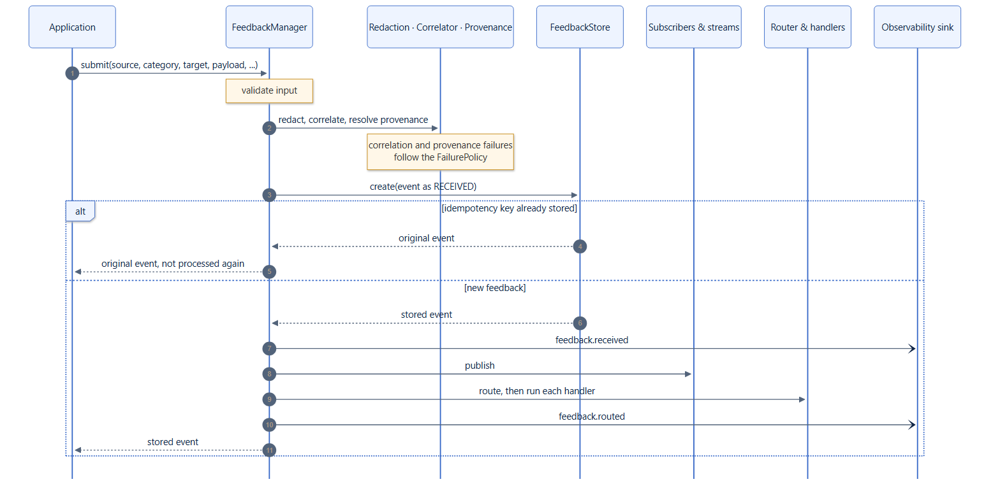

# Concepts overview

feedback-manager treats feedback as data with a life of its own. A piece of
feedback is created when something happens (a correction, an approval, a
failure, a score), refers to a precise part of an execution, is grouped with
related feedback, and is worked on until someone resolves, rejects, cancels, or
expires it.

## The moving parts

| Part | Responsibility |
|---|---|
| [`FeedbackManager`](../api/manager.md) | The service your application calls: submit, transition, query, subscribe, stream. |
| [`FeedbackEvent`](feedback-events.md) | One immutable piece of feedback: who sent it, what it is, what it is about, and where it happened. |
| [Lifecycle](lifecycle.md) | The validated state machine every event moves through. |
| [Correlator](correlation.md) | Groups related feedback under one correlation ID. |
| [Provenance](provenance.md) | Links feedback to the `langgraph-xai` records of the run it is about. |
| [Router and handlers](routing.md) | Decide which of your handlers react to new feedback, and run them. |
| [Store](storage.md) | Persists events and answers queries. |
| [Subscribers and streams](delivery.md) | Push every new event and lifecycle change to your code. |
| [Observability sink](observability.md) | Receives a typed event for every lifecycle change and failure. |
| Integrations | Capture feedback from LangChain callbacks, tool calls, and LangGraph interrupts. |

## What happens on submit

1. The input is validated into a `FeedbackEvent`. Invalid input raises
   `FeedbackValidationError` before anything else happens.
2. The redaction policy, if any, removes sensitive data.
3. The correlator assigns the correlation ID, and the provenance adapter, when
   a `langgraph-xai` runtime is configured, attaches a provenance reference.
4. The event is stored as `RECEIVED` in a single write. If its idempotency key
   is already stored, the original event is returned and nothing else runs.
5. The event is published to subscribers and open streams, and the router
   selects handlers, which run one after another.

Correlation, provenance, routing, handlers, and subscribers can fail without
losing the feedback: each stage follows its [failure mode](../how-to/failure-isolation.md).
A store failure always raises, because feedback that was not stored cannot be
processed.

## Who owns what

feedback-manager deliberately does not reimplement what your frameworks
already do.

| Concern | Owner |
|---|---|
| Executing graphs, state, checkpoints, retries | LangGraph |
| Pausing and resuming for human input (`interrupt`, `Command`) | LangGraph |
| Callbacks, tools, models, streaming | LangChain |
| What ran and why it was decided (provenance, decisions, evidence) | langgraph-xai |
| Tracing and performance monitoring | Your tracing platform, such as LangSmith or OpenTelemetry |
| **Feedback about all of the above: capture, correlation, storage, routing, lifecycle** | **feedback-manager** |

feedback-manager runs inside your process, starts no background tasks or
threads, and changes nothing about how your graphs execute.

## Design properties

- **Immutable events.** Updates produce new copies, so events can be shared
  across tasks and threads without locks.
- **Open vocabularies.** Sources, categories, and target types come with
  well-known values, and accept any other non-empty string.
- **Explicit lifecycle.** Every legal move is listed in one table; everything
  else is rejected.
- **Atomic transitions.** Lifecycle changes are compare-and-set operations on
  the store, so concurrent updates never overwrite each other.
- **Isolated side effects.** A failing handler or sink never loses feedback.
- **Typed errors.** Every error derives from `FeedbackManagerError`.

The [design overview](../design.md) explains the reasoning behind each property.
