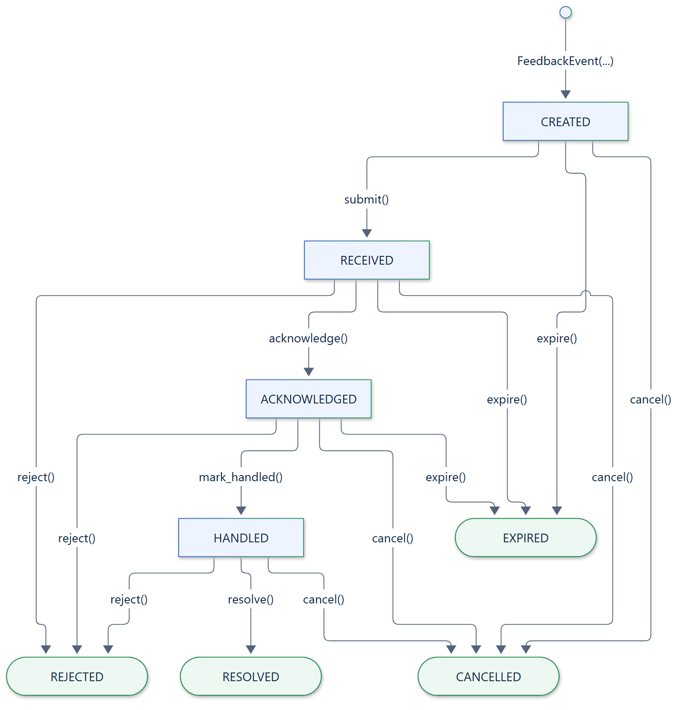
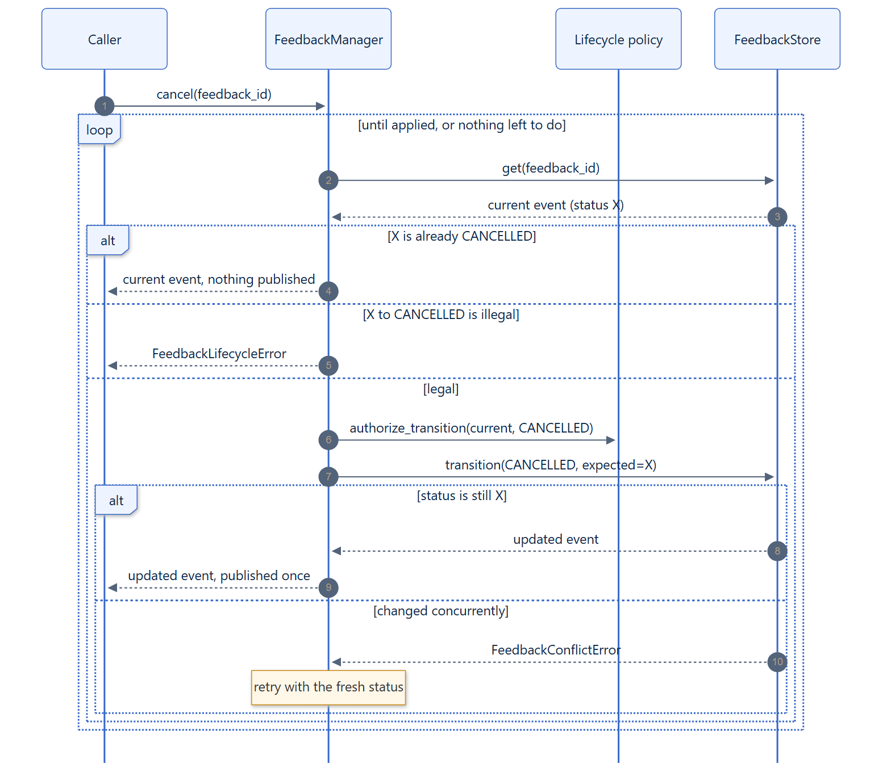

# Lifecycle

Every feedback event moves through an explicit state machine. The legal moves
are listed in one table, `LEGAL_TRANSITIONS`; every other move is rejected.

[](../assets/diagrams/lifecycle.png)

## Statuses

| Status | Meaning | Reached with |
|---|---|---|
| `CREATED` | Built, not yet stored. | Constructing a `FeedbackEvent` |
| `RECEIVED` | Stored and published; awaiting a consumer. | `submit()` |
| `ACKNOWLEDGED` | A consumer has seen it and taken ownership. | `acknowledge()` |
| `HANDLED` | Work on it finished; awaiting a final resolution. | `mark_handled()` |
| `RESOLVED` | Closed: acted upon successfully. | `resolve()` |
| `REJECTED` | Closed: declined or not applicable. | `reject()` |
| `CANCELLED` | Closed: withdrawn before completion. | `cancel()` |
| `EXPIRED` | Closed: left pending for too long. | `expire()`, `expire_overdue()` |

`submit()` stores feedback directly as `RECEIVED` in a single write, so stored
feedback is never `CREATED`. The four closed statuses are terminal: nothing
leaves them (`TERMINAL_STATUSES`).

## Legal moves

| From | To |
|---|---|
| `CREATED` | `RECEIVED`, `CANCELLED`, `EXPIRED` |
| `RECEIVED` | `ACKNOWLEDGED`, `REJECTED`, `CANCELLED`, `EXPIRED` |
| `ACKNOWLEDGED` | `HANDLED`, `REJECTED`, `CANCELLED`, `EXPIRED` |
| `HANDLED` | `RESOLVED`, `REJECTED`, `CANCELLED` |
| Terminal statuses | None |

Two rules follow from the table. Feedback can only be resolved after it was
handled, and handled feedback no longer expires: it waits for its resolution.

```python
await manager.acknowledge(feedback_id)
await manager.mark_handled(feedback_id)
await manager.resolve(feedback_id, resolution={"applied_to": "faq"})
```

An illegal move raises `FeedbackLifecycleError`, which carries the statuses
involved:

```python
try:
    await manager.resolve(feedback_id)  # still ACKNOWLEDGED
except FeedbackLifecycleError as error:
    print(error.current_status, "->", error.requested_status)  # acknowledged -> resolved
```

## Idempotent calls

Moving an event to the status it is already in returns it unchanged and
publishes nothing, so retrying a lifecycle call after a timeout is always safe.
This includes terminal statuses: rejecting rejected feedback again returns it
as it is, with its original resolution.

## Resolutions

`resolve`, `reject`, and `cancel` record how the feedback was closed in its
`resolution`, a JSON object. `reason` is shorthand for a `"reason"` entry:

```python
rejected = await manager.reject(
    feedback_id, reason="duplicate", resolution={"duplicate_of": "fb-1"}
)
rejected.resolution  # {'duplicate_of': 'fb-1', 'reason': 'duplicate'}
```

## Business rules

The state machine decides which moves are structurally legal. A
`FeedbackLifecyclePolicy` adds your business rules on top, such as "only an
assigned reviewer may resolve feedback":

```python
from feedback_manager import FeedbackEvent, FeedbackLifecycleError, FeedbackStatus
from feedback_manager.contracts import FeedbackLifecyclePolicy


class ReviewerResolves(FeedbackLifecyclePolicy):
    def authorize_transition(self, feedback: FeedbackEvent, target: FeedbackStatus) -> None:
        if target is FeedbackStatus.RESOLVED and "reviewer" not in feedback.metadata:
            raise FeedbackLifecycleError("assign a reviewer before resolving")


manager = FeedbackManager(lifecycle_policy=ReviewerResolves())
```

The policy sees the event's current state before every move. A policy that
fails with another exception denies the move with a `FeedbackLifecycleError`
that chains the original error.

## Concurrent updates

Several workers may update the same feedback at once, for example a reviewer
resolving it while a retention job expires it. Every transition is a
compare-and-set on the store: it applies only if the status is still the one
the manager read.

[](../assets/diagrams/transition-cas.png)

When the status changed in between, the manager re-reads the event, checks the
move against its fresh status, asks the lifecycle policy again, and retries.
As a result:

- concurrent updates never overwrite each other;
- each change is published to subscribers, streams, and the observability sink
  exactly once;
- a move that became illegal fails with `FeedbackLifecycleError` instead of
  being applied to stale data.

`FeedbackConflictError` reaches your code only if an event keeps changing on
every retry, which a store that reports conflicts truthfully never causes.

## Checking moves yourself

The state machine is public, for UIs that only offer legal actions or for your
own stores:

```python
from feedback_manager import FeedbackStatus, validate_transition
from feedback_manager.core import LEGAL_TRANSITIONS, is_legal_transition

is_legal_transition(FeedbackStatus.RECEIVED, FeedbackStatus.RESOLVED)  # False
LEGAL_TRANSITIONS[FeedbackStatus.HANDLED]  # RESOLVED, REJECTED, CANCELLED

# Raises FeedbackLifecycleError for an illegal move; describes a legal one.
move = validate_transition(feedback_id, FeedbackStatus.HANDLED, FeedbackStatus.RESOLVED)
move.idempotent  # False
```
