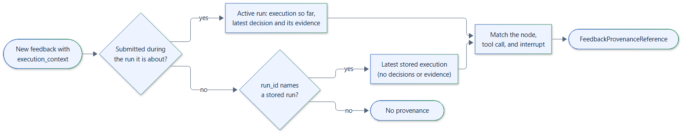

# Provenance

Feedback says *that* something was wrong or right. Provenance says *what ran*
and *why it was decided*. When feedback-manager is given a
[langgraph-xai](https://github.com/smuniharish/langgraph-xai) runtime, each
new piece of feedback gets a `FeedbackProvenanceReference`: a pointer to the
`langgraph-xai` records of the run, node, tool call, human interaction,
decision, and evidence it is about.

```python
from langgraph_xai import XAIRuntime

from feedback_manager import FeedbackManager

xai = XAIRuntime(application_id="support-bot", tenant_id="acme", graph_id="refunds")
manager = FeedbackManager(xai_runtime=xai)
graph = xai.instrument(builder.compile())
```

feedback-manager never captures provenance itself: it reads what
`langgraph-xai` recorded and translates it into a reference.

## The reference

| Field | Points at |
|---|---|
| `run_id` | The `langgraph-xai` run. |
| `execution_id` | The run's `Execution` record. |
| `summary` | A one-line description, such as `langgraph-xai run 273f... (completed): 2 node execution(s), 0 tool execution(s)`. |
| `node_execution_id` | The latest execution of the feedback's `node_id` in the run. |
| `tool_execution_id` | The tool execution with the feedback's `tool_call_id`. |
| `human_interaction_id` | The human interaction recorded for the feedback's `interrupt_id`. |
| `decision_id` | The latest decision of the run, for feedback submitted during the run. |
| `evidence_ids` | The evidence that decision relied on or, without a decision, all evidence so far. |
| `metadata` | The run status, graph and thread IDs, the run it continues, and record counts. |

## How a run is found

[](../assets/diagrams/provenance-resolution.png)

The adapter follows the feedback's `execution_context.run_id`:

- **During the run.** Feedback submitted inside an instrumented call, without a
  `run_id` or with the active run's ID, refers to the active run. The reference
  includes the latest decision and its evidence.
- **After the run.** Feedback whose `run_id` names a finished run is matched
  with that run's latest `Execution` in the runtime's provenance store. The
  reference has no decision or evidence IDs, because `langgraph-xai` keeps
  decisions and evidence in the live run and hands them to its plugins instead
  of storing them.
- **Otherwise** the feedback has no provenance, and `provenance` is `None`.

Within the run, the reference names the node execution, tool execution, and
human interaction matching the context's `node_id`, `tool_call_id`, and
`interrupt_id`.

!!! note "Node executions are recorded when nodes finish"
    `langgraph-xai` records a node execution when the node returns. Feedback
    submitted from inside a node therefore has no `node_execution_id` for that
    node yet; feedback submitted later, or from a later node, does.

## Getting the run ID right

The run ID must be the `langgraph-xai` run ID, which is what the integration
helpers read:

- inside a node or tool, `execution_context_from_config(config)` reads the run
  ID `langgraph-xai` puts in the config's metadata;
- after a graph paused, `execution_context_from_snapshot(snapshot)` reads it
  from the checkpoint's metadata;
- `FeedbackCallbackHandler` records it with every failure;
- after the run, use the ID from `xai.collect_runs()` or from your own records.

## When resolution fails

Provenance is the `PROVENANCE` stage of the
[failure policy](../how-to/failure-isolation.md). By default, a failure is
logged and the feedback is stored without provenance. In `BLOCKING` mode,
`submit` raises `FeedbackCorrelationError` and nothing is stored.

Stored-run lookups query the runtime's `ProvenanceStore` with
`langgraph_xai.StoreFilter`, which the bundled stores support. A custom
provenance store must support the same filter.

## Resolving provenance later

To resolve provenance for an event outside `submit`, for example for feedback
loaded from your database, use the adapter directly:

```python
from feedback_manager.integrations.xai import XAIProvenanceAdapter

reference = await XAIProvenanceAdapter(xai).resolve(feedback)
```

[Linking feedback to provenance](../how-to/xai-provenance.md) walks through a
complete graph, and [example 06](../examples/basics.md#06-provenance) runs it.
