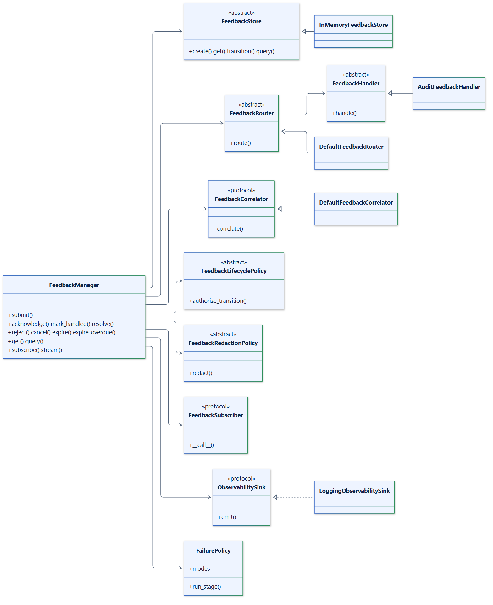

# Design overview

The reasoning behind feedback-manager's design, for readers evaluating it or
extending it.

## Principles

**Feedback is the domain; frameworks own execution.** LangGraph and LangChain
already own execution, state, checkpoints, interrupts, callbacks, and
streaming. feedback-manager adds the one concern they leave open: feedback
about that execution. Integrations translate framework objects into feedback
and never change how graphs run. `langgraph-xai` owns provenance, and feedback
refers to its records instead of copying them.

**Immutable events.** A `FeedbackEvent` never changes; transitions produce new
copies. An event held by a handler, a subscriber, or another thread is a
stable snapshot, and sharing events needs no locks.

**Open vocabularies.** Sources, categories, and target types are open values:
well-known constants plus any other non-empty string. Applications meet kinds
of feedback no library can anticipate, and closed enumerations would force
them to misuse the nearest constant or fork the package.

**An explicit lifecycle.** Legal moves are a table, `LEGAL_TRANSITIONS`, not
logic spread over methods. It is easy to review, to test exhaustively, and to
mirror in a UI. Same-status moves are legal no-ops, which makes every lifecycle
call safe to retry. The lifecycle has no cycles, which keeps compare-and-set
retries bounded.

**Atomic transitions in the store.** A lock in the manager would protect one
process only. The store contract makes each transition a compare-and-set
instead, so the database arbitrates between processes. The manager re-reads,
re-validates, and re-authorizes on conflict, so business rules always see the
current state, and each change is published once.

**Single-write submission.** `submit` stores feedback directly as `RECEIVED`,
in one write. There is no window in which a crash leaves half-submitted
feedback behind, and idempotent creation is one atomic operation.

**Failure isolation with clear limits.** Side effects that can fail
independently (correlation, provenance, routing, each handler, each subscriber)
run through a per-stage failure policy, best-effort by default. Two things are
never isolated: persistence, because feedback that was not stored cannot be
processed, and redaction, because storing unredacted data is never an
acceptable fallback. Observability sinks are always isolated, because
monitoring must not break the thing it monitors.

**Small, typed contracts.** Stateful extension points (`FeedbackStore`,
`FeedbackRouter`, `FeedbackHandler`, the policies) are abstract base classes,
which document and enforce their methods. Single-method callables
(`FeedbackCorrelator`, `FeedbackSubscriber`, `ObservabilitySink`) are
protocols, which plain functions and objects satisfy without inheritance.

**No hidden state or background work.** Managers share nothing, so tenants,
tests, and application areas can each have their own. The package starts no
tasks or threads: expiry, reconciliation, and delivery to other processes run
when and where your application decides.

**Light to import.** `import feedback_manager` loads none of LangGraph,
LangChain, or `langgraph-xai`. Integrations import their framework when they are
used.

## Extension points

## Package layout

| Module | Responsibility |
|---|---|
| `feedback_manager` | The public entry point: `FeedbackManager` and the most used names. |
| `feedback_manager.core` | The domain model and the lifecycle state machine; no I/O. |
| `feedback_manager.contracts` | The extension contracts and `FeedbackQuery`. |
| `feedback_manager.storage` | `InMemoryFeedbackStore`. |
| `feedback_manager.correlation` | The default correlation strategy. |
| `feedback_manager.routing` | Rule-based routing. |
| `feedback_manager.handlers` | `AuditFeedbackHandler`. |
| `feedback_manager.policies` | Failure isolation and retention. |
| `feedback_manager.observability` | Observability events and sinks. |
| `feedback_manager.integrations` | Adapters for LangChain, LangGraph, and `langgraph-xai`. |
| `feedback_manager.errors` | The exception hierarchy. |

Dependencies point inward: integrations depend on the core and contracts, and
the core depends only on pydantic and the error types.

## Non-goals

feedback-manager deliberately is not:

- **a tracing or monitoring platform:** use LangSmith, OpenTelemetry, or
  `langgraph-xai`; feedback-manager emits feedback-specific events into them;
- **a message bus or task queue:** subscribers deliver in-process; publish to
  your broker from a subscriber;
- **a user interface:** the [Streamlit example](examples/production.md#streamlit-ui)
  shows how small one can be;
- **an evaluation framework:** evaluators produce feedback that
  feedback-manager records and routes;
- **an agent runtime or self-improvement loop:** it records and routes
  feedback; deciding what to change, and changing it, stays with your
  application and the people running it.
