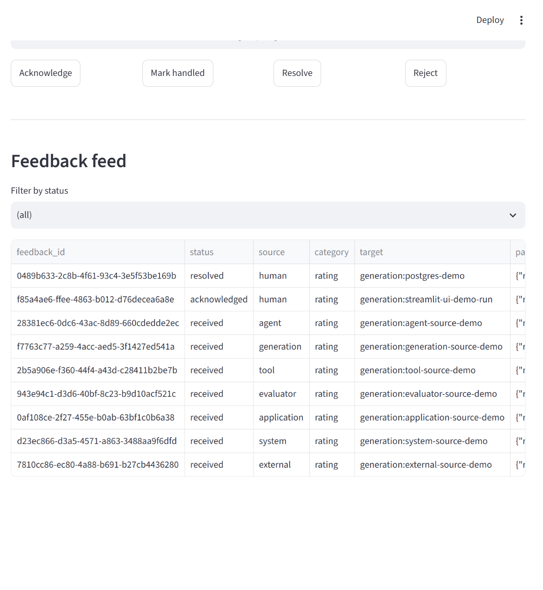

# Example: a real human-feedback capture UI (Streamlit)

`feedback-manager` is a library, not a UI product -- but application
developers still need *some* surface for a human to actually submit
feedback. No existing Grafana-style panel maps cleanly onto
"submit/acknowledge/resolve a `FeedbackEvent`", so this example is a
small, real, runnable Streamlit app wired directly to a live
`FeedbackManager`.

By default it uses `InMemoryFeedbackStore`. Set
`FEEDBACK_MANAGER_POSTGRES_DSN` to point it at the real PostgreSQL store
from the [previous example](postgres-store.md) instead, so feedback
survives Streamlit's reruns and process restarts.

Full source, embedded directly from `examples/streamlit_feedback_ui.py`:

```python title="examples/streamlit_feedback_ui.py"
--8<-- "examples/streamlit_feedback_ui.py"
```

Run it with:

```console
$ uv run streamlit run examples/streamlit_feedback_ui.py
```

## Verified against a real database

The UI was actually opened in a browser, a feedback event was submitted through the form, and then verified end-to-end against the real PostgreSQL container:

```console
$ podman exec fm-postgres psql -U feedback -d feedback_manager \
    -c "SELECT feedback_id, status FROM feedback_events ORDER BY created_at DESC LIMIT 2;"
              feedback_id              |  status
--------------------------------------+--------------
 f85a4ae6-ffee-4863-b012-d76decea6a8e | acknowledged
 0489b633-2c8b-4f61-93c4-3e5f53be169b | resolved
```

The first row (`f85a4ae6...`) was submitted through the UI's "Submit feedback" form, then transitioned to `acknowledged` by clicking the UI's "Acknowledge" button -- both real writes to the real database, not simulated.

## Screenshot


## Every `FeedbackSource`, submitted for real through the UI

The dropdown exposes all eight well-known `FeedbackSource` values (not just
`human`), and each one was actually clicked and submitted through the running
UI, then verified against the real PostgreSQL row it produced:



```console
$ podman exec fm-postgres psql -U feedback -d feedback_manager \
    -c "SELECT status, data->>'source' AS source, data->'target'->>'id' AS target FROM feedback_events ORDER BY created_at;"
    status    |   source    |         target
--------------+-------------+-------------------------
 resolved     | human       | postgres-demo
 acknowledged | human       | streamlit-ui-demo-run
 received     | agent       | agent-source-demo
 received     | generation  | generation-source-demo
 received     | tool        | tool-source-demo
 received     | evaluator   | evaluator-source-demo
 received     | application | application-source-demo
 received     | system      | system-source-demo
 received     | external    | external-source-demo
(9 rows)
```

For exhaustive coverage of every *combination* of source, category, and
target type (not just source in isolation), see
[the full matrix example](full-matrix.md).
