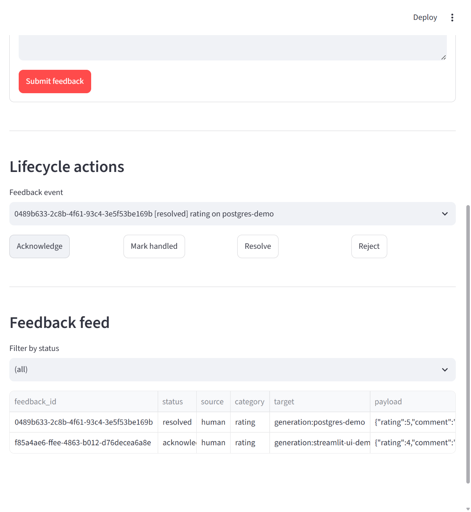

# Example: a real human-feedback capture UI (Streamlit)

Source file: `examples/streamlit_feedback_ui.py`

`feedback-manager` is a library, not a UI product -- but application developers still need *some* surface for a human to actually submit feedback. No existing Grafana-style panel maps cleanly onto "submit/acknowledge/resolve a `FeedbackEvent`", so this example is a small, real, runnable Streamlit app wired directly to a live `FeedbackManager`.

Run it with:

```console
$ uv run streamlit run examples/streamlit_feedback_ui.py
```

By default it uses `InMemoryFeedbackStore`. Set `FEEDBACK_MANAGER_POSTGRES_DSN` to point it at the real PostgreSQL store from the [previous example](postgres-store.md) instead, so feedback survives Streamlit's reruns and process restarts.

Key pattern -- bridging `FeedbackManager`'s async API into Streamlit's synchronous script model:

```python
def _run(coro):
    return asyncio.run(coro)

@st.cache_resource
def get_manager() -> FeedbackManager:
    return FeedbackManager(store=...)  # shared across reruns in one session

event = _run(manager.submit(source=..., category=..., target=..., payload=...))
```

## Verified against a real database

The UI was actually opened in a browser, a feedback event was submitted through the form, and then verified end-to-end against the real PostgreSQL container:

```console
$ podman exec fm-postgres psql -U feedback -d feedback_manager \
    -c "SELECT feedback_id, status FROM feedback_events ORDER BY created_at DESC LIMIT 2;"
              feedback_id              |  status
--------------------------------------+--------------
 f85a4ae6-ffee-4863-b012-d76decea6a8e | acknowledged
 0489b633-2c8b-4f61-93c4-3e5f53be169b | resolved
```

The first row (`f85a4ae6...`) was submitted through the UI's "Submit feedback" form, then transitioned to `acknowledged` by clicking the UI's "Acknowledge" button -- both real writes to the real database, not simulated.

## Screenshot


