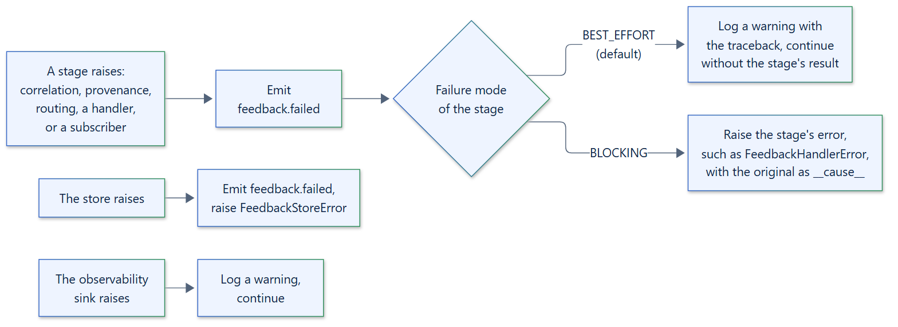

# Configure failure isolation

Feedback processing calls code you do not control: your correlator, the
provenance runtime, your router, your handlers, your subscribers. By default a
failure in any of them is logged and processing continues, so the feedback is
never lost because a ticketing system was down. `FailurePolicy` lets you make
individual stages raise instead.

[](../assets/diagrams/failure-isolation.png)

## Stages

| Stage | Runs | Best-effort failure | Blocking error |
|---|---|---|---|
| `CORRELATION` | Your correlator | The default correlation ID is used. | `FeedbackCorrelationError`; nothing is stored. |
| `PROVENANCE` | The `langgraph-xai` lookup | Stored without provenance. | `FeedbackCorrelationError`; nothing is stored. |
| `ROUTING` | Your router, and the handlers it selects | No handlers run. | `FeedbackRoutingError`; the feedback is stored. |
| `HANDLER` | Each handler, and the result it returns | The next handler runs. | `FeedbackHandlerError`; the feedback is stored. |
| `SUBSCRIBER` | Each subscriber | The next subscriber runs. | `FeedbackSubscriberError`; the change is stored. |

Every stage is `BEST_EFFORT` by default. Override the ones you need; the
others keep the default:

```python
from feedback_manager import FeedbackManager
from feedback_manager.policies import FailureMode, FailurePolicy, FeedbackStage

manager = FeedbackManager(
    failure_policy=FailurePolicy(modes={FeedbackStage.HANDLER: FailureMode.BLOCKING})
)
```

Stages and modes may also be given as strings, such as
`FailurePolicy(modes={"handler": "blocking"})`. An unknown stage or mode raises
`FeedbackConfigurationError` immediately.

## What a failure looks like

In both modes, the manager first emits `feedback.failed` with the `stage`,
`error_type`, and `error`, so dashboards and alerts see every failure.

**Best-effort** then logs a warning with the traceback on the
`feedback_manager.policies.failure` logger and continues:

```text
event='feedback stage failed; continuing' stage='handler' feedback_id='d46ed140-8a1a-4066-bb8e-f2dd21bfe54a' error_type='ConnectionError'
Traceback (most recent call last):
  ...
ConnectionError: ticketing system unreachable
```

**Blocking** raises the stage's error, with the original exception as its
`__cause__` and the stage in its `context`:

```python
try:
    await manager.submit(...)
except FeedbackHandlerError as error:
    error.feedback_id      # the feedback being processed
    error.context          # {'stage': 'handler'}
    error.__cause__        # ConnectionError('ticketing system unreachable')
```

Routing, handler, and subscriber stages run after the feedback is stored, so a
blocking failure there reports a problem with a side effect, not a lost event.
Retrying `submit` with the same `idempotency_key` returns the stored event
without running the handlers again.

## Failures that are never isolated

- **Invalid input** raises `FeedbackValidationError` before processing starts.
  A redaction policy that fails raises `FeedbackValidationError` too, because
  storing unredacted data is never an acceptable fallback.
- **Store failures** raise `FeedbackStoreError`: feedback that was not stored
  cannot be processed.
- **Observability sink failures** are always isolated: the manager logs a
  warning and continues, whatever the policy says.

## Choosing modes

- Keep `BEST_EFFORT` in production for handlers and subscribers whose work can
  be retried from the store, and alert on `feedback.failed`.
- Use `BLOCKING` for a handler whose failure must reach the caller, such as a
  compliance hook.
- Use `BLOCKING` for every stage in tests, so a broken handler fails the test
  instead of logging a warning:

```python
STRICT = FailurePolicy(modes=dict.fromkeys(FeedbackStage, FailureMode.BLOCKING))
```
