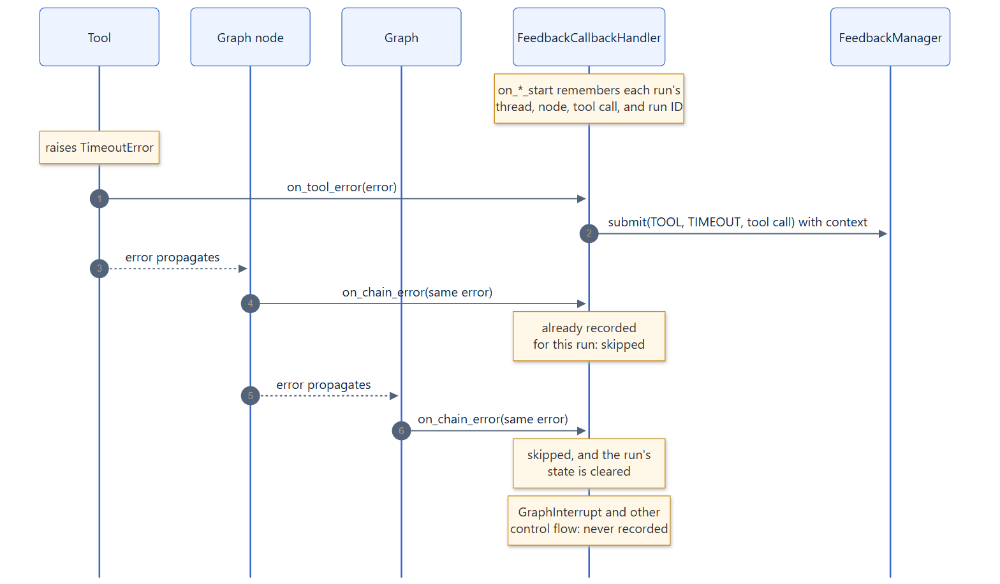

# Record LangChain failures

Tools time out, models hit rate limits, retrievers fail. With
`FeedbackCallbackHandler`, each of those failures becomes one feedback event,
recorded where it happened, while your application keeps handling the
exception exactly as before.

## Attach the callback handler

Pass the handler in the run's `callbacks`. LangChain hands it to every nested
runnable, including LangGraph nodes, tools, models, and retrievers.

```python
from langchain_core.runnables import RunnableConfig

from feedback_manager import FeedbackManager
from feedback_manager.integrations.langchain import FeedbackCallbackHandler

manager = FeedbackManager()
config: RunnableConfig = {
    "callbacks": [FeedbackCallbackHandler(manager)],
    "configurable": {"thread_id": "weather-chat-3"},
}

try:
    await graph.ainvoke({"messages": []}, config)
except TimeoutError as error:
    ...  # handle it as usual; the failure is already recorded
```

With a tool that raises `TimeoutError`, [example 03](../examples/basics.md#03-tool-failure)
records:

```text
Recorded tool/timeout feedback about tool_call 'call-weather-1' (thread=weather-chat-3, node=tools)
  payload: {'error': "weather service did not answer for 'Canberra' within 5 seconds", 'error_type': 'TimeoutError', 'operation': 'fetch_weather'}
```

## One failure, one event

A failure propagates through every enclosing runnable, and LangChain reports it
to each of them: the tool, the node, and the graph. The handler records it once,
where it happened, and ignores the same error as it bubbles up.

[](../assets/diagrams/langchain-capture.png)

## Cancellations and timeouts

Cancelling a run cancels every run inside it, and when one node fails, LangGraph
cancels the other nodes that are still running. Those cancellations are a
consequence of something else, so they are not recorded on their own:

| What happens | Recorded |
|---|---|
| Your code cancels a graph run, for example when a client disconnects or an `asyncio.timeout` around `ainvoke` expires | One `cancellation` about the run (`target.type` is `run`) |
| A node fails while other nodes run in parallel | The node's failure only |
| A node exceeds its LangGraph `timeout` | One `timeout` about the node (`NodeTimeoutError`) |
| A node raises `asyncio.CancelledError` itself | One `cancellation` about the node (`NodeCancelledError`) |
| An `asyncio.timeout` inside a node expires and the `TimeoutError` propagates | One `timeout` about the node |

A model or tool call that your code cancels and recovers from, inside a run
that then succeeds, is not recorded. Record it yourself if it matters, as
[example 04](../examples/basics.md#04-generation-interruption) does for an
interrupted generation.

## What is recorded

| Failure in | `source` | `target` | `feedback_type` |
|---|---|---|---|
| A tool | `tool` | `tool_call` with the tool call ID | `tool_error` |
| A chat model or LLM | `generation` | `generation` with the run ID | `model_error` |
| A retriever | `tool` | `run` with the run ID | `retriever_error` |
| A graph node or chain | `agent` | `node` with the node name, or `run` | `chain_error` |

- **Category:** `timeout` for `TimeoutError` and LangGraph's
  `NodeTimeoutError`, `cancellation` for `asyncio.CancelledError` and
  `NodeCancelledError`, and `failure` for everything else
  (`category_for_error`).
- **Payload:** `error` (the message), `error_type` (the exception class), and
  `operation` (the name of the failing tool, model, or node).
- **Execution context:** the thread, node, and tool call of the failing run
  and, in a `langgraph-xai` instrumented graph, the run ID that links the
  feedback to its [provenance](../concepts/provenance.md).

LangGraph control flow is not a failure: interrupts and other `GraphBubbleUp`
signals are never recorded. Success is not recorded either; whether an outcome
deserves feedback is your application's decision.

If recording a failure fails, for example because the store is unreachable,
LangChain logs the callback error as a warning, the manager emits
`feedback.failed`, and the original exception still propagates unchanged.

## Tool calls outside LangChain

Code that calls a tool directly, without a LangChain runnable, produces no
callbacks. Wrap the call in `capture_tool_feedback` to get the same `TOOL`
feedback:

```python
from feedback_manager.integrations.langchain import capture_tool_feedback

async with capture_tool_feedback(manager, tool_call_id=call_id, tool_name="search"):
    result = await mcp_session.call_tool("search", arguments)
```

The original exception always propagates unchanged. If the feedback cannot be
recorded, the recording failure is logged and attached to the original
exception as a note, instead of replacing it. A cancellation of the task
running the call passes through unrecorded: it comes from outside the tool
call. Pass `execution_context` to record where the call happened.
