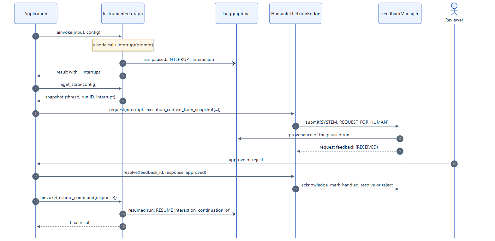

# Record human-in-the-loop decisions

LangGraph pauses a graph for human input with `interrupt()` and resumes it
with `Command(resume=...)`. `HumanInTheLoopBridge` adds a feedback record of
each pause and its answer: why the graph paused, who was asked what, and what
they decided. The decision then becomes queryable, routable, and auditable like
any other feedback.

LangGraph keeps owning the pause and the resume; the bridge never changes how
the graph executes.

[](../assets/diagrams/hitl-sequence.png)

## 1. Pause the graph with `interrupt()`

Interrupts need a checkpointer, so the graph can resume where it paused.

```python
from langgraph.checkpoint.memory import InMemorySaver
from langgraph.graph import END, START, StateGraph
from langgraph.types import interrupt


def confirm(state: State) -> State:
    decision = interrupt({"question": "Send the refund email?", "action": state["action"]})
    return {"action": state["action"], "decision": decision}


builder = StateGraph(State)
builder.add_node("confirm", confirm)
builder.add_edge(START, "confirm")
builder.add_edge("confirm", END)
graph = builder.compile(checkpointer=InMemorySaver())
```

## 2. Record the request once the graph paused

When the graph pauses, `ainvoke` returns the pending interrupts under
`__interrupt__`; `extract_interrupts` reads them, from a result or from a
`stream_mode="updates"` chunk. The paused state snapshot identifies the thread,
checkpoint, node, and interrupt.

```python
from feedback_manager import FeedbackManager, FeedbackTarget, FeedbackTargetType
from feedback_manager.integrations.langgraph import (
    HumanInTheLoopBridge,
    execution_context_from_snapshot,
    extract_interrupts,
)

manager = FeedbackManager()
bridge = HumanInTheLoopBridge(manager)
config = {"configurable": {"thread_id": "refund-1042"}}

paused = await graph.ainvoke({"action": "send_refund_email"}, config)
(pending,) = extract_interrupts(paused)
snapshot = await graph.aget_state(config)

request = await bridge.request(
    target=FeedbackTarget(type=FeedbackTargetType.NODE, id="confirm"),
    interrupt=pending,
    execution_context=execution_context_from_snapshot(snapshot),
)
```

The request is `SYSTEM` feedback in the `request_for_human` category, with the
interrupt's value as its `payload["prompt"]` and the interrupt ID in its
execution context. Pass `prompt=` to record a different prompt, `category=` for
another category, and `metadata=` for your own details.

!!! warning "Record the request outside the node"
    Call `request` after the graph paused, not inside the node before
    `interrupt()`: LangGraph runs the node again from the start when it
    resumes, so a request recorded inside the node would be recorded twice.

## 3. Record the decision

Show the prompt to a person in your application. When they decide, record the
answer:

```python
decision = await bridge.resolve(request.feedback_id, response="approved", approved=True)
decision.status      # resolved
decision.resolution  # {'response': 'approved', 'approved': True}
```

- `approved=True`, or `None` for answers that are not an approval, resolves the
  request, moving it through `ACKNOWLEDGED` and `HANDLED` as needed.
- `approved=False` rejects it.
- Calling `resolve` again with the same decision returns the closed request.

## 4. Resume the graph

```python
result = await graph.ainvoke(bridge.resume_command("approved"), config)
```

`resume_command(response)` builds `Command(resume=response)`. When several
interrupts are pending at once, resume one with
`resume_command(response, interrupt_id=pending.id)`.

[Example 02](../examples/basics.md#02-human-in-the-loop-approval) runs these
steps end to end:

```text
Graph paused; approval request 5b193dcf-c6ef-4677-a983-1061d497a0fc is received
Prompt shown to the reviewer: {'question': 'Send the refund email?', 'action': 'send_refund_email'}
Decision recorded: resolved, resolution={'response': 'approved', 'approved': True}
Graph resumed and finished: {'action': 'send_refund_email', 'decision': 'approved'}
```

## Retries and idempotency

To make a retried `request` return the original record instead of a second one,
pass an `idempotency_key` that identifies the pause in your application, for
example the thread and checkpoint IDs. The interrupt ID alone is not enough:
successive `interrupt()` calls in one node share it.

## With langgraph-xai

When the graph is instrumented by `langgraph-xai` and the manager has the
runtime, `execution_context_from_snapshot` also records the run ID of the
paused run. The request's [provenance](../concepts/provenance.md) then points
at that run and at the human interaction `langgraph-xai` recorded for the
interrupt. [Example 08](../examples/agents.md#08-deepagents-with-human-approval)
does this with a `deepagents` agent whose file edits require approval.
