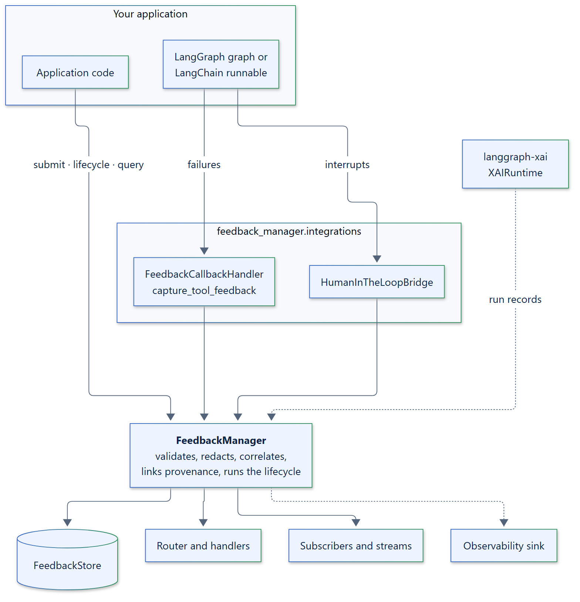

# feedback-manager

**Feedback infrastructure for LangChain and LangGraph applications.**

Agent applications constantly receive feedback: a reviewer approves a refund, a
user corrects an answer, a tool times out, an evaluator scores a response, a
person stops a generation halfway. feedback-manager makes that feedback a
first-class, queryable record. Each piece of feedback is captured with the
execution it is about, grouped with related feedback, stored, routed to your
handlers, and tracked through an explicit lifecycle until it is resolved.

LangChain and LangGraph keep owning execution, state, checkpoints, interrupts,
and streaming. feedback-manager owns the feedback *about* that execution, and
links it to the [langgraph-xai](https://github.com/smuniharish/langgraph-xai)
provenance of the run it refers to.

[](assets/diagrams/architecture-overview.png)

## Why feedback-manager

<div class="grid cards" markdown>

-   **One model for every kind of feedback**

    ---

    Human corrections, approvals, tool failures, evaluator scores, and
    interruptions share one immutable `FeedbackEvent`, with open sources,
    categories, and target types you can extend without subclassing.

-   **Captured where it happens**

    ---

    A LangChain callback handler records tool, model, retriever, and chain
    failures once, with the thread, node, and tool call they happened in. A
    bridge records LangGraph human-in-the-loop requests and decisions.

-   **An explicit, race-free lifecycle**

    ---

    Feedback moves through a validated state machine with compare-and-set
    transitions: concurrent updates never overwrite each other, and every
    change is published exactly once.

-   **Linked to provenance**

    ---

    With a `langgraph-xai` runtime, feedback points at the run, node, tool
    call, decision, and evidence it is about, so you can answer "what was this
    feedback about, and why did the agent do that?"

-   **Isolated from your failures**

    ---

    A failing handler, subscriber, router, or observability sink never loses
    feedback. Choose per stage whether a failure is logged or raised.

-   **Bring your own infrastructure**

    ---

    Swap the store, router, correlator, policies, and observability sink
    through small, typed contracts. A production PostgreSQL store is included
    as an example.

</div>

## A first look

```python
import asyncio

from feedback_manager import FeedbackManager, FeedbackTarget, FeedbackTargetType


async def main() -> None:
    manager = FeedbackManager()
    feedback = await manager.submit(
        source="human",
        category="correction",
        target=FeedbackTarget(type=FeedbackTargetType.GENERATION, id="gen-42"),
        payload={"corrected_text": "Canberra is the capital of Australia."},
    )
    print(feedback.status)  # received


asyncio.run(main())
```

`FeedbackManager()` works without configuration: it keeps feedback in memory
and logs one structured record per lifecycle event. Continue with the
[quickstart](getting-started/quickstart.md), or jump to what you need:

<div class="grid cards" markdown>

-   [**Record LangChain failures**](how-to/langchain-failures.md)

    Turn tool timeouts and model errors into feedback automatically.

-   [**Record human-in-the-loop decisions**](how-to/langgraph-hitl.md)

    Keep an auditable record of every LangGraph interrupt and its answer.

-   [**Store feedback in your database**](how-to/custom-store.md)

    Implement the four-method store contract, or adapt the PostgreSQL example.

-   [**Explore the examples**](examples/index.md)

    Runnable programs, from a single correction to a live Grafana dashboard.

</div>

## Requirements

- Python 3.12 or later.
- `langgraph`, `langgraph-xai`, `pydantic`, and `structlog`, installed
  automatically. `langchain-core` comes with `langgraph`.

feedback-manager is released under the
[Apache License 2.0](https://github.com/smuniharish/feedback-manager/blob/master/LICENSE).
